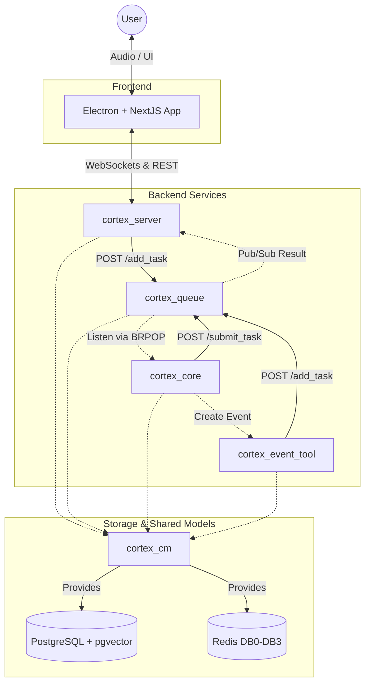

# Cortex AI Assistant
<p align="center">
  
</p>
Advanced, memory-aware personal operating system assistant which seamlessly listens to user queries via audio, transcribes them into text, and leverages powerful LangGraph workflows to generate intelligent responses. Unlike traditional assistants, Cortex can understand the gap between conversations, align responses based on user past emotional profile and mood-specific behaviour, making it a truly proactive personal assistant.

## Key Features

### Memory-Aware Conversations
Cortex retrieves historically relevant context to maintain more natural and context-aware conversations. It can recall past interactions, user preferences, and emotional cues to provide personalized responses. Task Retrieval allows the user to know about the previously asked tasks and their status.

### Non-blocking Execution and Audio Streaming
Unlike traditional AI talking systems, where the user asks, then waits for the response, Cortex is designed to handle heavy computational loads of AI reasoning without blocking real-time user interactions. You can ask "Search for the best places to visit in Goa" and while the system is processing, you can ask "What was the weather like in Goa last week?" without waiting for the first response. Cortex will seamlessly handle both queries, providing responses as they become available.

### Proactive Personal Assistant
Cortex is designed with user experience in mind. For queries, which require more in-depth reasoning, instead of leaving the user wondering if the system is still processing, Cortex provides fallback responses like "Let me think about that..." or "I'm looking into it for you..." to keep the user informed and engaged while the system works on generating a more comprehensive answer.

### Emotional Profiling and Mood-Based Response Tuning
Cortex can analyze the user's emotional state based on their interactions and adjust its responses accordingly. For example,
- If a user doesn't prefer long responses in the evening, Cortex can automatically provide concise answers during that time, while offering more detailed responses at other times.
- If a user shows some specific behavior or preference for a given time of day, say Night, Cortex will try to consider them in future conversations for the same time and mood.

### Active Memory Building
Cortex actively builds and updates a memory profile for the user, which includes preferences, past interactions, and emotional cues. This allows it to provide more personalized and relevant responses over time, creating a more engaging experience.

## System Architecture
The project adopts a highly decoupled, microservice-like architecture to handle the heavy computational loads of AI reasoning without blocking real-time user interactions.



## Modules & Documentation
The repository is divided into distinct, purpose-built modules. **For detailed technical specifications, architecture diagrams, and API endpoints, please refer to the specific module's README:**

*   **[app/](app/README.md)** - The user-facing Electron and NextJS application. Handles audio recording, WebSocket streaming, and UI for tasks, history, and settings.
*   **[cortex_server/](cortex_server/README.md)** - The FastAPI server. Manages real-time WebSocket communication, audio transcription (STT), text-to-speech (TTS) streaming via an Audio Bridge, and standard REST APIs.
*   **[cortex_queue/](cortex_queue/README.md)** - The task ingestion and result distribution hub. Safely offloads heavy LLM processing from the WebSocket server and ensures state persistence in PostgreSQL before caching.
*   **[cortex_core/](cortex_core/README.md)** - The "brain" of the assistant. Runs the LangGraph workflows, implements Maximal Marginal Relevance (MMR) for context retrieval, handles memory retrieval and building, and dynamically adjusts response tones based on time and user mood.
*   **[cortex_event_tool/](cortex_event_tool/README.md)** - The precise, cron-driven background worker. Monitors Redis for scheduled reminders and injects them into the queue at the perfect time.
*   **[cortex_cm/](cortex_cm/README.md)** - The Common Module. Centralizes database schemas (SQLModel), Redis client configurations, and global AI model loaders.

## Quick Start / Setup

### Users
Pre-built binaries are available for users who want to run the application directly. Please check the [releases](../../releases) section of this GitHub repository to download and run the executable file for your operating system. For detailed instructions on using the application, including how to interact with the assistant, manage settings, and utilize features like user configurations, please refer to the [app/README.md](app/README.md).

### Developers
For developers who wish to build from source or contribute to the project, the entire backend infrastructure is containerized and orchestrated using Docker Compose.

**Prerequisites:**
*   Docker & Docker Compose
*   Hugging Face Token (for specific model downloads)
*   A `.env` file populated based on `.env.example`
*   Google Authentication credentials

**Running the System:**
To spin up the PostgreSQL database, Redis instance, and all Python-based microservices:

```bash
docker-compose up --build
```

**Services Started:**
*   `cortex-pg-db`: PostgreSQL 17 with `pgvector` on port `5460` (configurable).
*   `cortex-redis-db`: Redis on port `6379`.
*   `cortex-queue`: The central task routing API on port `8001`.
*   `cortex-server`: The client-facing WebSocket and REST API on port `8000`.
*   `cortex-core`: The background LLM reasoning worker.
*   `cortex-event-worker`: The background scheduling worker.

To run the frontend application, navigate to the `app/` directory and refer to its specific documentation.

## ENV Guide
The application requires several environment variables to function correctly. Copy `.env.example` to `.env` and configure the following:

### Database (PostgreSQL)
*   **POSTGRES_USER**: The username for the PostgreSQL database (default: `postgres`).
*   **POSTGRES_DB**: The name of the database to be created and used.
*   **POSTGRES_PASSWORD**: The password for the database user.
*   **POSTGRES_PORT**: The port mapping for the PostgreSQL container (default: `5460`).

### Cache and Pub/Sub (Redis)
*   **REDIS_HOST**: The hostname for the Redis service (use `redis` for Docker Compose).
*   **REDIS_PORT**: The port for Redis communication (default: `6379`).

### Service Ports
*   **CORTEX_QUEUE_PORT**: The port assigned to the cortex_queue service (default: `8001`).
*   **CORTEX_SERVER_PORT**: The port assigned to the cortex_server service (default: `8000`).

### System Settings
*   **TZ**: The system timezone used for accurate logging and event scheduling (e.g., Asia/Kolkata).

### AI Models (Hugging Face)
*   **HF_TOKEN**: Your Hugging Face token required to download gated models or access private repositories.
*   **HF_CACHE_DIR**: The internal container path where models are cached (default: /root/.cache/huggingface).
*   **TRANSFORMERS_CHECK_LOCAL_CACHE**: Set to 1 to force the system to use locally cached models only, or 0 to allow automatic downloads of missing weights.

### Authentication (Google OAuth)
*   **GOOGLE_CLIENT_ID**: Your Google Cloud project OAuth 2.0 Client ID.
*   **GOOGLE_CLIENT_SECRET**: Your Google Cloud project OAuth 2.0 Client Secret.
*   **GOOGLE_REDIRECT_URI**: The authorized redirect URI for OAuth callbacks (e.g., http://localhost:3000/api/auth/callback/google).
*   **GOOGLE_AUTH_URI**: The Google OAuth 2.0 authorization endpoint.
*   **GOOGLE_TOKEN_URI**: The Google OAuth 2.0 token exchange endpoint.

## Cortex AI Workflow vs Agent Workflow
One thing a fellow developer might be confused about is why LangGraph workflows are used instead of an autonomous agent workflow. The reason is simple:
- **Control and Predictability:** I wanted to have more control over the flow of the conversation and the reasoning process. With a LangGraph workflow, I can define specific steps and logic for handling user queries, managing memory, and generating responses. 
- **Consistency:** Agent workflows decide their path on their own based on the query provided, which can lead to unpredictable behavior and less control over the user experience.
- **Objective:** My objective was to create a more structured and consistent conversational experience, which is better achieved with a custom workflow rather than pure autonomous AI agents.

## Model Selection
Cortex utilizes centralized model loading via the `cortex_cm` module, assigning specific models to the tasks they are best suited for:
- **Planning and Routing:** Qwen models (`Qwen/Qwen2.5-7B-Instruct`) are utilized for localized planning as they demonstrate strong structural reasoning and are trained heavily on coding/logic tasks.
- **Orchestration & Heavy Planning:** GPT models (`openai/gpt-oss-20b`) are utilized for the main orchestrator and complex planning tasks that require deep, structured reasoning over large contexts.
- **Conversations:** Meta's Llama models (`meta-llama/Llama-3.1-8B-Instruct` and `meta-llama/Llama-3.3-70B-Instruct`) are used for normal, fluid conversations and heavy response generation as they are trained extensively on general, human-like dialogue.
- **Vector Search & Memory:** Sentence Transformer models (`sentence-transformers/all-MiniLM-L6-v2`) are employed specifically for Maximal Marginal Relevance (MMR) and vector similarity search.
- **Sensory Processing:** OpenAI Whisper (`openai/whisper-small`) is used for highly accurate local Speech-to-Text (STT) transcription, and the Kokoro pipeline (`hexgrad/Kokoro-82M`) is used for low-latency Text-to-Speech (TTS) synthesis. Emotion detection relies on BERT (`boltuix/bert-emotion`).

## Upcoming Features
- **More Exciting Tools Integration:** Currently, the Cortex Core has three specialized tools (Web Search, Task Retrieval, and Event Creation). My next plan is to bring more tools to the system to further enhance capabilities, such as calendar management, music player control, and email management.
- **Agentic Workflow (+ HITL):** I am planning to integrate an Agentic workflow to allow the system to autonomously plan out complex scenarios. For example, if a user asks "Plan a trip to Goa for me", the system could autonomously plan the itinerary, book hotels, and suggest activities based on preferences. I also want to integrate Human-in-the-Loop (HITL) for critical tasks where human oversight is necessary to ensure accuracy and safety.
- **More Language Support:** Currently, the system primarily supports English, but I plan to expand its capabilities to support multiple languages, making it accessible to a wider audience.
- **Enhanced Emotional Profiling:** I want to further enhance the emotional profiling capabilities of the system, allowing it to better understand and respond to user emotions, creating an even more empathetic and personalized experience.

## Hugging Face Models Credit
This project relies on several open-source models hosted on Hugging Face:
- [Qwen/Qwen2.5-7B-Instruct](https://huggingface.co/Qwen/Qwen2.5-7B-Instruct)
- [meta-llama/Llama-3.1-8B-Instruct](https://huggingface.co/meta-llama/Llama-3.1-8B-Instruct)
- [meta-llama/Llama-3.3-70B-Instruct](https://huggingface.co/meta-llama/Llama-3.3-70B-Instruct)
- [sentence-transformers/all-MiniLM-L6-v2](https://huggingface.co/sentence-transformers/all-MiniLM-L6-v2)
- [openai/whisper-small](https://huggingface.co/openai/whisper-small)
- [hexgrad/Kokoro-82M](https://huggingface.co/hexgrad/Kokoro-82M)
- [boltuix/bert-emotion](https://huggingface.co/boltuix/bert-emotion)
- [openai/gpt-oss-20b](https://huggingface.co/openai/gpt-oss-20b)

## Thanks
For any query or suggestion, email me on mohit.vsht@gmail.com