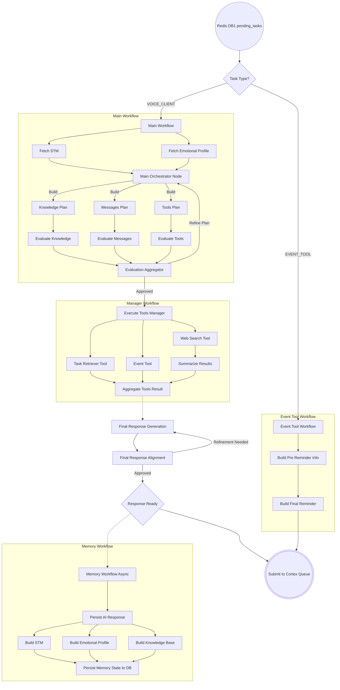

# Cortex Core
The `Main Brain of the Cortex AI`. This module acts as the principal orchestrator, handling LangGraph workflow executions for deep thinking, orchestration, memory management, tool execution, and user profiling.
        
It listens to a `Redis DB1`, processes user queries through dynamic plan generation and execution, and submits final responses back to the system (`Redis DB2`), via the `Cortex Queue`.
    
## Core Concepts & Workflows
    
Cortex Core is divided into four main LangGraph workflows:
       
### 1. Main Workflow
The central orchestration loop that receives user queries and determines the action plan.
*   **Phase 1: Retrieval** - Fetches the Short Term Memory (STM) and Emotional Profile of the user.
*   **Phase 2: Orchestration** - Three independent plans are built by the planner and evaluated:
    *   *Knowledge Plan:* Retrieves long-term user memory/preferences.
    *   *Messages Plan:* Retrieves past conversation history if referred to by the user.
    *   *Tools Plan:* Determines which tools are required and generates specific instructions.
    *   *Evaluation & Aggregation:* The Main Orchestrator aggregates evaluated plans and iterates the refinement until the plans are optimal or a maximum iteration limit is reached.
*   **Phase 3: Tool Execution** - Executes the generated tools via the **Manager Workflow**.
*   **Phase 4: Final Response** - LLM generates the final response aligned with user emotions and preferences, optionally refining it based on evaluator feedback, before submitting to `Cortex Queue`.
       
#### Plan and Evaluation Logic
- For the first pass, all three plans are executed. In subsequent iterations, the Main Orchestrator decides which plan(s) to refine based on the evaluation feedback and retrieved information, allowing for dynamic reasoning.
- In the first pass, Message and Tool Planners can choose to skip execution if the LLM determines they are not needed, but Knowledge Plan is always executed for first time to ensure user preferences are considered if any.

### 2. Manager Workflow
Triggered by the Main Workflow to execute tools in parallel.
*   Executes tools based on orchestrator instructions.
*   **Available Tools:**
    *   `WebSearchTool`: Searches the web for live data.
    *   `TaskRetrieverTool`: Retrieves user's past tasks based on time, description, or recency.
    *   `EventTool`: Custom reminder/event creation logic.
*   Aggregates and summarizes results (e.g., summarizing raw web data) before returning to the Main Orchestrator.

### 3. Memory Workflow
Executed asynchronously after the final response is submitted. It handles state persistence without blocking the user response.
*   **Persist AI Response:** Saves the final response to Postgres.
*   **Build Short Term Memory (STM):** Summarizes conversation if the unsummarized message count exceeds the threshold.
*   **Update Emotional Profile:** Updates emotional, logical, and social metrics based on the current interaction.
*   **Update User Knowledge Base:** Extracts and stores long-term facts/preferences with strictness constraints (`MUST`, `SHOULD`, `CANNOT`, `CAN`).

### 4. Event-Tool Workflow
A standalone workflow that triggers when a reminder task is fetched, bypassing standard text-generation to yield a customized human-like reminder message based on time of day and event context.

---

## Workflow Architecture Diagram



---

## Directory Structure

```text
cortex_core/
├── main/                   # Main Orchestrator implementations, Models, Prompts, Routes
├── manager/                # Tool Execution Manager & Tool Definitions (Web, Task, Event)
├── memory/                 # Memory Builders, Retrievers, Embeddings, Persistence Services
├── event_tool/             # Logic and prompts for the standalone Event reminder workflow
├── graph/                  # LangGraph Definitions
│   ├── state/              # Pydantic State definitions for all workflows
│   ├── workflow.py         # Main Workflow Graph Compilation
│   ├── manager.py          # Manager Workflow Graph Compilation
│   ├── memory.py           # Memory Workflow Graph Compilation
│   └── event.py            # Event Tool Workflow Graph Compilation
├── worker.py               # Main Entrypoint: Listens to Redis Queue for pending tasks
├── req.py                  # API requests to Cortex Queue (Redis DB2 submission)
└── req.test.py             # Mock submission service for testing queue
```

---

## Inter-Module Dependencies

*   **`cortex_cm`**: Used for Database Engine/Models (Postgres via SQLModel), Redis Client configurations, logging setup, time utilities, and fetching base models/embedding layers.
*   **`cortex_queue`**: Uses `TaskItem` and `TaskStatus` DTOs for type-safe queue validation.
*   **`cortex_event_tool`**: Called by the `EventTool` to manage actual event registration records in the DB.

---

## Development & Usage

**Run the Core Worker**
Starts the loop to listen to `pending_tasks` on Redis DB 1, process it via Main/Event workflow, and push results downstream.
```bash
python worker.py
```
However, it is started by default using the `docker-compose` setup for the entire Cortex system.

**Run the Mock Service (For testing isolated UI/Queue streams without heavy LLMs)**
Starts a FastAPI service to mock completed voice queries and event creation, submitting dummy `TaskItem` structures directly to the Queue. It will help in testing `cortex-core -> cortex-queue` integration.
```bash
python req.test.py
```