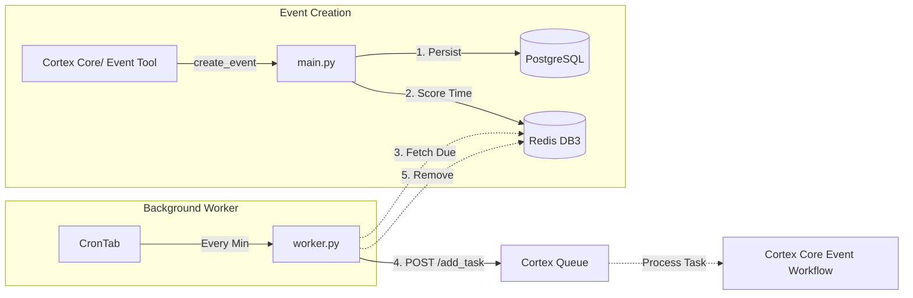

# Cortex Event Tool

The background worker dedicated to scheduling, tracking, and triggering time-based events and reminders for the Cortex AI application.

## Why Do We Need It?

Handling delayed actions (like "Remind me to call John in 3 hours") requires an independent system that doesn't block active chat sessions or rely on persistent WebSocket connections. 

The `cortex_event_tool` isolates this responsibility:
1.  **Precise Scheduling:** It runs a continuous loop driven by `python-crontab` to check for due events every minute.
2.  **High-Performance Polling:** Instead of querying the PostgreSQL database continuously, it polls a global Redis Sorted Set (ZSET) where events are scored by their trigger times.
3.  **Proactive Reminders:** It calculates an `effective_trigger_time` by subtracting a user-defined `reminder_window` (e.g., 5 minutes) from the actual event time, ensuring the AI reminds the user *before* the event happens.

---

## Core Architecture Diagram



---

## Key Features & Workflows

### 1. Fast Polling via Redis (ZSET)
When an event is created, its metadata is hashed and its `effective_trigger_time` is added as a score in a Redis Sorted Set (DB 3). The worker efficiently uses `ZRANGEBYSCORE` to fetch only the events whose score is less than or equal to the current epoch time.

### 2. Queue Integration
Once an event is deemed "due", the worker formats an `AddTaskRequest` payload and submits it to the `cortex_queue` HTTP endpoint (`/api/queue/add_task`). The task is flagged with the `TaskOwner.EVENT_TOOL` identity. 

### 3. Cleanup
After successfully submitting the task to the queue, the worker immediately deletes the event from the Redis cache to prevent duplicate triggers during the next cron cycle.

---

## Directory Structure

```text
cortex_event_tool/
├── main.py                 # Core event logic (create, get_due, remove) using PG and Redis
├── worker.py               # The crontab-driven background polling loop
└── req.test.py             # Mock submission script for testing the queue integration
```

---

## Inter-Module Dependencies

*   **`cortex_cm`**: Supplies the Redis client (DB 3 specifically for events), PostgreSQL models (`UserEvent`, `EventStatus`), and the `get_reminder_window_minutes` config helper.
*   **`cortex_queue`**: The worker makes HTTP requests to the Queue's API to inject the event into the further AI processing pipeline.

---

## Development & Usage

Starts the continuous crontab loop that monitors Redis for due events.
```bash
python worker.py
```
*(Note: In production, this worker runs as an independent container service defined in `docker-compose.yml`)*

### Local Testing (`req.test.py`)

A standalone FastAPI service is provided for testing the worker and queue integration without running the full `cortex_core`.

```bash
python req.test.py
```
This starts the test service on `http://0.0.0.0:8002`, exposing:
*   `POST /create_event`: Mocks event creation of  `cortex_core` event tool (sets `is_test=True` for local Redis connections).
*   `GET /get_events/{user_id}`: Retrieves events for a given user.
