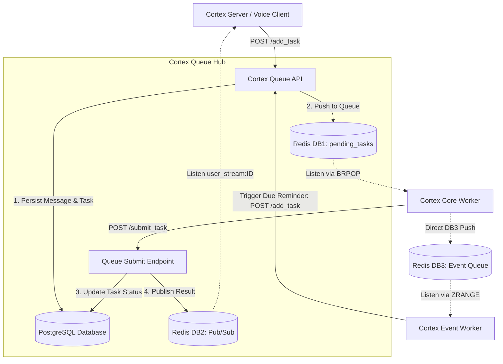

# Cortex Queue

The task ingestion and result distribution hub for the Cortex AI application. `cortex_queue` is a lightweight FastAPI service that acts as a stateful bridge between the client-facing servers (`cortex_server`) and the heavy backend processing workers (`cortex_core`, `cortex_event_tool`).

## Why Do We Need It?

In an AI-driven architecture, deep reasoning and orchestration (handled by `cortex_core`) can take several seconds to complete. This will lead to two problems:
1.  **Blocking:** If the `cortex_server` directly awaited these processes, it would block the WebSocket connections and degrade performance.
2.  **Execution and Work Distribution Load:** Without a queue, the `cortex_server` would have to handle task creation, database persistence, and result distribution, which is inefficient and error-prone. The `cortex_core` worker and `event-tool` worker needs to directly work with server and handle database persistence and update logic by itself.

The `cortex_queue` solves this by providing:
1.  **Decoupling:** Safely offloads heavy LLM workloads from the WebSocket server.
2.  **State Persistence:** Acts as the gateway to PostgreSQL. Before putting a task on the volatile Redis queue, it saves the initial `Message` and `Task` states to the database. This ensures no data is lost if a worker or cache fails.
3.  **Unified Pub/Sub Routing:** When workers complete a task, they submit the result back to the Queue. The Queue updates the database status and broadcasts the payload to Redis Pub/Sub (`user_stream:{user_id}`), instantly pushing it to the correct user's active WebSocket connection.
4.  **Common Interface for Services:** Both `cortex_server` and `cortex_event_tool` can add there tasks to the same queue, to be processed by the `cortex_core` worker. This creates a unified task processing pipeline and allows for future extensibility (e.g., other internal services can also submit tasks to the queue without needing to implement their own persistence and routing logic).

---

## Core Architecture Diagram



---

## API Endpoints

The service exposes the following endpoints via the `task_router` (`/api/queue`):

*   **`POST /add_task`**
    *   **Purpose:** Ingests a new task request (`AddTaskRequest`).
    *   **Logic:** Depending on the `task_owner` (`VOICE_CLIENT` or `EVENT_TOOL`), it resolves identities, saves the initial conversational messages to the database, creates a `QUEUED` Task record in PostgreSQL, and finally `lpush`es the task JSON to Redis DB1 (`pending_tasks`).
*   **`POST /submit_task`**
    *   **Purpose:** Receives completed or failed tasks from the `cortex_core` worker.
    *   **Logic:** Updates the task's final status and result/error in PostgreSQL. It then publishes the result to Redis DB2 on the specific channel `user_stream:{user_id}`.
*   **`POST /save_messages`**
    *   **Purpose:** Utility endpoint for synchronously saving conversational turns (User query and Voice Client response) to the database without generating a full task.
*   **`GET /get_task`** & **`GET /get_result/{task_id}`**
    *   **Purpose:** Direct polling access to Redis DB1 and DB2 for debugging or alternative integration flows.

---

## Directory Structure

```text
cortex_queue/
├── main.py                 # FastAPI Application Entrypoint and Lifespan Manager
├── controllers/
│   └── task.py             # FastAPI Routers defining the API Endpoints
├── dto/
│   └── __init__.py         # Data Transfer Objects (TaskItem, AddTaskRequest)
└── service/
    ├── event.py            # Event-specific task saving and PostgreSQL status updates
    ├── saver.py            # Handles persisting conversational messages to PostgreSQL
    ├── task.py             # Core logic for routing add/submit tasks between PG and Redis
    └── utility.py          # Lazy-loaders for MemorySaver and Embedding Models
```

---

## Inter-Module Dependencies

*   **`cortex_cm`**: Supplies the Redis client modes, database engine, SQL models (e.g., `TaskStatus`, `TaskOwner`), and logger configurations.
*   **`cortex_core`**: The queue relies on `cortex_core.memory.service.saver.MemorySaver` to perform the actual PostgreSQL persistence logic for tasks and messages.

---

## Development & Usage

Starts the FastAPI server on port `8001`. It relies on pre-loading embedding models via the lifespan manager before accepting requests.
```bash
python main.py
```
*(Note: In production, this service is managed and started automatically via `docker-compose`)*