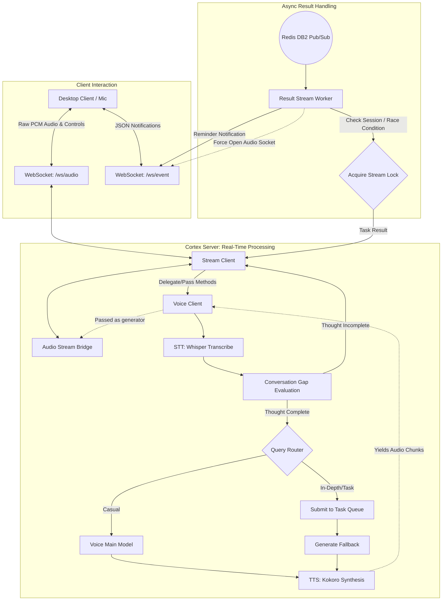

# Cortex Server

The Backend Server for the Cortex AI application. It provides standard REST API endpoints for the desktop client, integrates third-party authentication, and orchestrates high-performance WebSocket connections for real-time audio and event streaming. 

This module acts as the real-time interaction bridge, assigning deep-thinking tasks to the `cortex_queue` while keeping the user engaged with immediate feedback.

## Key Features & Architecture

### Architecture Diagram



### 1. Advanced Stream Service & Websockets
Real-time interaction is handled through two dedicated WebSocket channels:
*   **/ws/audio:** Handles raw binary PCM audio data and voice-related JSON control events. It utilizes the `AudioStreamBridge` to safely pipe data between the client and AI models.
*   **/ws/event:** Reserved strictly for backend-to-client notifications, primarily for triggering reminders.

**Key Stream Capabilities:**
*   **Race Condition Handling & Stream Locks:** The `VoiceStateManager` tracks real-time concurrency flags (`is_user_speaking`, `is_ai_speaking`) across global memory. `asyncio.Lock` mechanisms ensure that STT (Speech-to-Text) and TTS (Text-to-Speech) streams do not overlap or corrupt the socket during rapid conversation turns.
*   **Conversation Gap Handling:** Analyzes user speech pauses using the LLM model to determine confidence on whether a user has finished their complete thought or sentence, accommodating natural hesitation.
*   **Result Worker (Pub/Sub):** A background `ResultStreamWorker` listens to Redis Pub/Sub channels for completed tasks from the `cortex_core`. Upon receiving a result, it safely acquires a stream lock and initiates TTS audio streaming back to the user.
*   **Force Websocket Open:** If a reminder is triggered (via the Event Tool) but the user's audio socket is closed, the Result Worker checks the user's `force_open_websocket` configuration. If enabled, it sends an `OPEN_AUDIO_WEBSOCKET` signal over the `/event` socket to forcefully wake up the UI and prompt it to re-establish the audio connection.

### 2. Cortex Sensory & Voice Layer
The Sensory module is similar to human sensory organs which interprets the user audio, understands the emotional context, and routes queries appropriately. It consists of:
*   **STT (Speech-to-Text):** Utilizes local Transformers (OpenAI Whisper) to transcribe raw 16-bit PCM audio. It features configurable chunking and batching strategies offloaded to background threads to prevent UI blocking.
*   **TTS (Text-to-Speech):** Utilizes the Kokoro pipeline for fast text-to-speech synthesis, yielding streaming PCM chunks for smooth, low-latency audio delivery.
*   **Voice Client:** The primary orchestrator of the Sensory layer. It leverages `VoiceMainModel` (for query routing, completion confidence) and `EmotionDetectionModel` to parse context. 
*   **Fallback Response Generation:** To avoid dead air during complex, long-running queries sent to the `cortex_queue` for deep thinking, the Voice Client streams an immediate, human-like "fallback" response (e.g., *"Please give me a minute, let me check"*). 

### 3. REST Controllers & Services
Provides traditional CRUD interfaces backed by `cortex_cm` Postgres models and Redis caches:
*   **Auth:** Google OAuth2 integration with local JWT.
*   **Config:** Manages user-specific settings (e.g., Voice timeout limits, timezone, force WebSocket behavior).
*   **Chat/Tasks/Events:** Fetching conversation threads, past task executions, and user reminders.

### 4. WebSocket Event Schema
The system uses a standardized JSON event map for all server-to-client communications over WebSockets. Each event includes a `type`, `stage`, and `message`.

| Event Key (`ResponseKey`) | Type | Stage | Description |
|:---:|:---:|:---:|:---|
| `conversation_start` | `conversation` | `started` | Ready to receive audio input |
| `conversation_end` | `conversation` | `ended` | Conversation session completed |
| `start_listening` | `interruption` | `started` | User started speaking; interruption handled |
| `finish_listening` | `interruption` | `finished` | User finished speaking; processing audio |
| `waiting_for_further_audio` | `interruption` | `waiting` | User paused; waiting for further audio |
| `ai_audio_stream_start` | `ai_stream` | `started` | AI begins streaming audio chunks |
| `ai_audio_stream_end` | `ai_stream` | `pending` | AI finished streaming audio chunks - is_depth is true |
| `ai_audio_stream_end` | `ai_stream` | `ended` | AI finished streaming audio chunks - is_depth is false or final response arrived |
| `reminder_triggered` | `reminder` | `triggered` | A user reminder has been triggered |
| `open_audio_websocket` | `audio_socket` | `open_request` | Server requesting UI to open audio socket |
| `no_audio` | `response` | `no_audio` | Error: No audio data received from client |
---

## Directory Structure

```text
cortex_server/
├── controller/                 # FastAPI Route Handlers (REST & WebSockets)
│   ├── auth.py                 # Google OAuth, JWT logic, and user stats
│   ├── chat_controller.py      # Conversation thread management
│   ├── config_controller.py    # User preferences and configurations
│   ├── event_controller.py     # Reminders and user event listings
│   ├── main.py                 # Health checks and mock query endpoints
│   ├── requestModels.py        # Pydantic schemas for requests/responses
│   ├── task_controller.py      # Execution history retrieval
│   └── websocket.py            # Primary /audio and /event socket routes
├── cortex/                     # Core AI interaction logic
│   ├── sensory/
│   │   ├── STT/                # Speech-to-Text using Whisper (Chunking/Batching)
│   │   └── TTS/                # Text-to-Speech using Kokoro streaming
│   └── voice/
│       ├── model.py            # Langchain routing, Completion evaluation, Emotion Detection
│       ├── prompts.py          # Strict prompt templates for fallback/casual responses
│       ├── req.py              # HTTP requests to Cortex Queue for deep tasks
│       └── utility.py          # Audio chunk generation & stream cancellation utilities
├── service/                    # Business Logic and Database Operations
│   ├── auth/                   # JWT & Dependency injection for protected routes
│   ├── chat_service.py         # Postgres ChatSession and Message operations
│   ├── config_service.py       # Config fetching with Redis caching fallback
│   ├── event_service.py        # Event tracking and count aggregations
│   ├── task_service.py         # Task history operations
│   └── stream/                 # Complex Async Streaming Mechanics
│       ├── audio_bridge.py     # Safe socket piping & PCM to WAV conversions
│       ├── event.py            # StreamEvent tracking (buffers, locks, cancellations)
│       ├── main.py             # StreamClient orchestrating gaps and fallback replies
│       ├── result_worker.py    # Redis Pub/Sub listener for async Queue results
│       └── state_manager.py    # UserVoiceState tracking concurrency & race conditions
└── server.py                   # FastAPI Application Entrypoint and Lifespan manager
```

---

## Inter-Module Dependencies

*   **`cortex_cm`**: Supplies Postgres SQLModel definitions (`User`, `ChatSession`, `Task`, `UserConfig`), Redis connection clients (DB0 for Config, DB2 for Pub/Sub results), and foundational logging utilities.
*   **`cortex_queue`**: While `cortex_server` processes immediate audio and casual chats locally, all complex queries (in-depth routing) are forwarded to `cortex_queue` via HTTP requests defined in `cortex/voice/req.py`.

---

## Development & Usage

**Run the Server**
The server exposes endpoints on port 8000 and is typically managed via Docker.
```bash
python server.py
```
*(Available locally at `http://localhost:8000`)*
